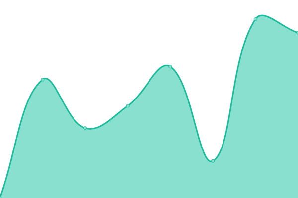
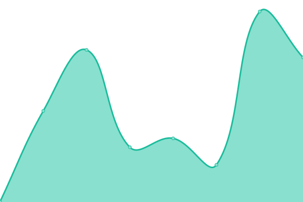

# [📈 Live Status](https://status.narwhal.cool): <!--live status--> **🟧 Partial outage**

This repository contains the open-source uptime monitor and status page for [Narwhal Ventures](https://narwhal.cool), powered by [Upptime](https://github.com/upptime/upptime).

With [Upptime](https://upptime.js.org), you can get your own unlimited and free uptime monitor and status page, powered entirely by a GitHub repository. We use [Issues](https://github.com/narwhalventures/status/issues) as incident reports, [Actions](https://github.com/narwhalventures/status/actions) as uptime monitors, and [Pages](https://status.narwhal.cool) for the status page.

<!--start: status pages-->
<!-- This summary is generated by Upptime (https://github.com/upptime/upptime) -->
<!-- Do not edit this manually, your changes will be overwritten -->
<!-- prettier-ignore -->
| URL | Status | History | Response Time | Uptime |
| --- | ------ | ------- | ------------- | ------ |
|  [Main Site](https://narwhal.cool) | 🟩 Up | [main-site.yml](https://github.com/narwhalventures/status/commits/HEAD/history/main-site.yml) | 

 2297ms
     
 | 

<a href="https://status.narwhal.cool/history/main-site">100.00%</a>
    

|  [Narwhal.gifts](https://narwhal.gifts) | 🟥 Down | [narwhal-gifts.yml](https://github.com/narwhalventures/status/commits/HEAD/history/narwhal-gifts.yml) | 

 661ms
     
 | 

<a href="https://status.narwhal.cool/history/narwhal-gifts">35.29%</a>
    

|  [Hastebin](https://haste.narwhal.cool) | 🟩 Up | [hastebin.yml](https://github.com/narwhalventures/status/commits/HEAD/history/hastebin.yml) | 

 435ms
     
 | 

<a href="https://status.narwhal.cool/history/hastebin">100.00%</a>
    

|  [Debug Reports](https://debug.narwhal.cool) | 🟩 Up | [debug-reports.yml](https://github.com/narwhalventures/status/commits/HEAD/history/debug-reports.yml) | 

 460ms
     
 | 

<a href="https://status.narwhal.cool/history/debug-reports">100.00%</a>
    

|  [Bot Server](192.99.42.133) | 🟩 Up | [bot-server.yml](https://github.com/narwhalventures/status/commits/HEAD/history/bot-server.yml) | 

 42ms
     
 | 

<a href="https://status.narwhal.cool/history/bot-server">100.00%</a>
    

<!--end: status pages-->

[**Visit our status website →**](https://status.narwhal.cool)

## 📄 License

- Powered by: [Upptime](https://github.com/upptime/upptime)
- Code: [MIT](./LICENSE) © [Narwhal Ventures](https://narwhal.cool)
- Data in the `./history` directory: [Open Database License](https://opendatacommons.org/licenses/odbl/1-0/)
